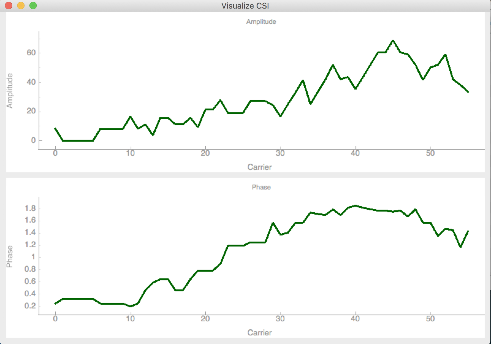

# CSI data retrieval, visualization and storing

This program is responsible for retrieving CSI data from the router (the one running `recvCSI` program), 
visualizing it in a realtime and storing it in a filesystem.

***Sample Setup for visualize CSI*** 

The setup consists of three devices. Two SoC's and one PC/Notebook

1. The first SoC (A) acts as an access point (AP). The other SoC (B) and the PC connect to that AP

2. A starts the recv_csi tool from [HERE](https://github.com/Retsediv/WIFI_CSI_based_HAR/tree/master/router/recvCSI)
   with the IP Address of the PC and the port 1234 `./recv_csi <PC IP> 1234`

3. The PC starts the `run_visualization_server.py` script from this folder

4. B starts the send_data tool from [HERE](https://github.com/Retsediv/WIFI_CSI_based_HAR/tree/master/router/sendData)
   and starts sending packages. Those packages should now be received by the PC

5. As the result you should see a plot of the CSI packet like in the picture below.

*Troubleshooting*:

- If the packages are not received by the PC there might be issues with the firewall
- Also check if you set the correct UDP port in `recvCSI` program arguments
- Check if you have installed `pyqt`.
